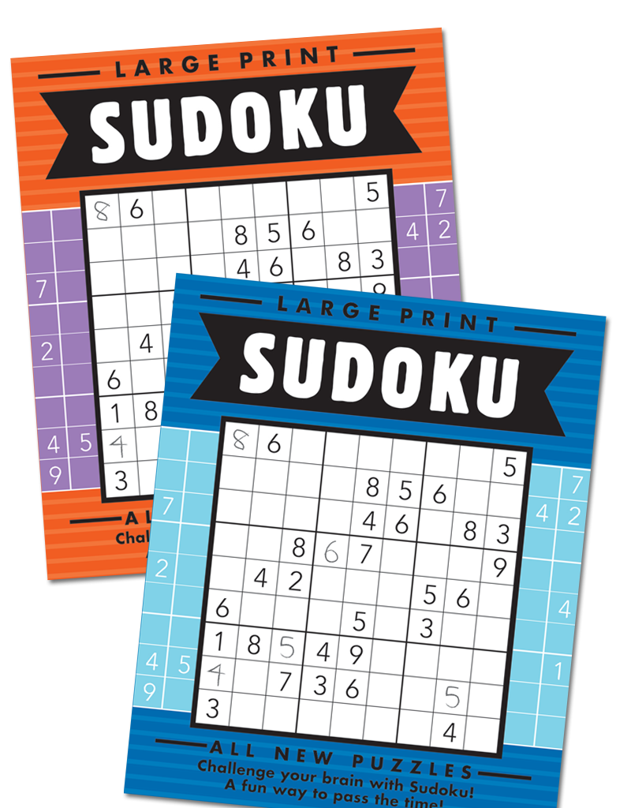

# Sudoku Game Solver

## About:

This is a Sudoku Game Solver Application that solves any 9x9 puzzle, by visualizing through the Backtracking Algorithm which is made using the PyGame library in Python.
You can choose to play or to watch the puzzle getting solved step by step.

## How to use

You can clone this repository by using

    git clone https://github.com/nassosanagn/Sudoku-Game-Solver.git

OR you can download and extract the zip file and it's contents.

## Execution

You can run the sudoku.py file directly in your terminal by using:

    python sudoku.py < input.txt  
**OR**

    python3 sudoku.py < input.txt

Where **input.txt** contains the 9x9 sudoku puzzle that you want to solve.
 
 ## Playing
 
 - You can enter a value in the puzzle by clicking in a cell and entering a value 1-9.
 - Correct answers will be permanently displayed while incorrect answers will be removed.
 - If at any point the player decides to solve the board, the Spacebar key can be pressed. This will commence a visual which will demonstrate how the backtracking algorithm works and how it is being applied in order to solve the board.
 - You have a total of 3 strikes. Then it's game over.

